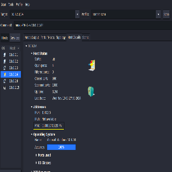
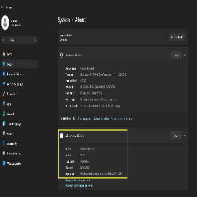
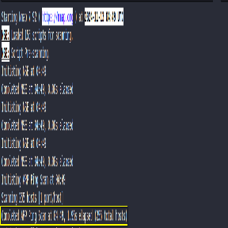
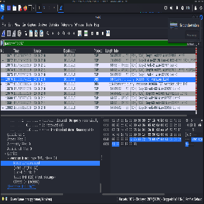

#

#

#

#

#

# **Cybersecurity Executive Summary**

## Violet Figueroa

### Table of Contents:

#### [Introduction](#introduction)    [3](#executive-summary)

#### [Executive Summary    3](#executive-summary)

#### [Recommendations    3](#recommendations)

#### [Detailed Findings    4](#detailed-findings)

#### [Information Collection Methodology    5](#information-collection-methodology)

#### [References and Citation    8](#references)

####

## Introduction {#introduction}

My name is Violet Figueroa. I am a Cybersecurity Analyst. I have been tasked with retrieving and analyzing all information on your NatNetwork digital infrastructure.

## Executive Summary {#executive-summary}

Your network relies on a flat network infrastructure. All devices are connected and accessible to each other through several access ports. Expanding the infrastructure will degrade response times, making the network unusable (Cisco, 2014).

## Recommendations {#recommendations}

Please switch your network design to a Hierarchical design. Your network has a flat network design. Flat networks lack segmentation and are more vulnerable to potential security breaches. A hierarchical design organizes them into layers for better traffic management and scalability. Hierarchical Network Design is now the best practice industry-wide to design networks that are reliable, resilient, scalable, and also cost-effective (Jain, 2022).

##

## Detailed Findings {#detailed-findings}

* Machine designation: Windows11
  * Device Host Name: WINDOWS11-DESKT
  * IP Address: 10.0.2.1/24
  * MAC address: 08:00:27:CB:20:4A
  * Operating System & version: Windows 11 Home 23H2 (nmap identifies it as window 10 1703\)
  * Open ports with associated services:
  * 53/tcp open domain PowerDNS Recursor
  * ARP Ping Scan elapsed time:1.92s elapsed (255 total hosts)

* Machine designation: LinuxServer1
  * Device Host Name: linux-server
  * IP Address: 10.0.2.15/24
  * MAC address: 08:00:27:dd:d8:f8
  * Operating System & version: Ubuntu 22.04.3
  * Open ports with associated services
  * 3306/tcp open mysql MySQL 8.0.37-0ubuntu0.22.04.3
  * ARP Ping Scan elapsed time: 1.95s elapsed (255 total hosts)

* Machine designation: KaliOpenVas
  * Device Host Name (ex. DESKTOP-JE9II55, etc): kali
  * IP Address: 10.0.2.8/24
  * MAC address: 08:00:27:1b:76:b0
  * Operating System & version: Kali Linux 2024.2 (Rolling Release)
  * Open ports with associated services: None found
  * ARP Ping Scan elapsed time: 1.97s elapsed (255 total hosts)

##

## Information Collection Methodology {#information-collection-methodology}

I started by turning on each of the virtual machines. I used cmd **ipconfig** (Harwood, 2023\) on the Windows 11 machine and learned its IP address. For the Linux Server Machine and Kali Linux machine, I used the cmd **ip a** (Mitchel & Novotny, 2022\) to determine each of their IP addresses. The Machine designations were the Virtual Machine names listed in the Virtual Box Menu. From this, I was able to confirm that all 3 machines were in the 10.0.2.\[0-255\] IP address range.

I started by opening Wireshark (Warnicke & Lamping, 2024\) and nmap (Lyon, 2009\) on my Kali Linux VM. I turned on Wireshark network traffic capture. I ran the following nmap command using Zenmap (Lyon, 2009): **nmap \-T4 \-A \-v 10.0.2.0/24**
This scan searched the virtual network and detected the 3 machines that were in the scope of the assignment. However, it also detected local services running on my devices that were outside the scope of the assignment. After confirming in an assistance request that the scope was only the 3 machines, I ran intensive scans on each of the 3 machines inside the scope 1 at a time.
I started by scanning the the Windows 11 virtual machine using **nmap \-T4 \-A \-v 10.0.2.1/24**. Device Host Name, WINDOWS11-DESKT, was located in the nmap scan in the HTTP header
***"http-title: Welcome | PRTG Network Monitor (WINDOWS11-DESKT)"***

Fig. 1: The MAC-Address was listed under the host details tab of the Zenmap GUI, in the addresses section.

Fig 2\. The nmap scan host details identify it as Windows 10 1703, but checking the machine device information lists it as Windows 11 Home 23H2.

Fig 3\. The ARP ping scan information was located at the start of the nmap output.

I used the same methods to acquire the information on the Linux Server.
For the Kali server, I used Linux commands, such as **ip a** (Mitchel & Novotny, 2022). The nmap scans did not show the information as it was the machine running the scans.

Fig 4\. This is the current topology map for the network. All devices on the network have access to each other because it is arranged as a flat network.

Fig 5\. The screenshot of Wireshark here shows that the Windows nmap scan was primarily done using TCP at the Transport Layer. The query of the Domain Name System (DNS) was done at the Application Layer. (Warnicke & Lamping, 2024\)

##

## References {#references}

1. Cisco. (2014, May 9). *Cisco Networking Academy Connecting Networks Companion Guide: Hierarchical Network Design \> Objectives*. Cisco Press. Retrieved November 15, 2024, from [https://www.ciscopress.com/articles/article.asp?p=2202410](https://www.ciscopress.com/articles/article.asp?p=2202410)
2. Jain, S. (2022, November 17). *Hierarchical Network Design*. GeeksforGeeks. Retrieved November 15, 2024, from [https://www.geeksforgeeks.org/hierarchical-network-design/](https://www.geeksforgeeks.org/hierarchical-network-design/)
3. Harwood, R. (2023, February 3). *ipconfig*. Microsoft Learn. Retrieved November 15, 2024, from [https://learn.microsoft.com/en-us/windows-server/administration/windows-commands/ipconfig](https://learn.microsoft.com/en-us/windows-server/administration/windows-commands/ipconfig)
4. Mitchel, J., & Novotny, J. (2022, June 16). *How to Use the ip Command in Linux*. Linode. Retrieved November 15, 2024, from [https://www.linode.com/docs/guides/how-to-use-the-linux-ip-command/](https://www.linode.com/docs/guides/how-to-use-the-linux-ip-command/)
5. Warnicke, E., & Lamping, U. (2024, 08 28). *Wireshark User's Guide*. Wireshark. Retrieved November 15, 2024, from [https://www.wireshark.org/docs/wsug\_html/](https://www.wireshark.org/docs/wsug_html/)
6. Lyon, G. “. (2009, January 1). *Nmap Network Scanning*. Nmap Network Scanning. Retrieved November 15, 2024, from [https://nmap.org/book/toc.html](https://nmap.org/book/toc.html)
